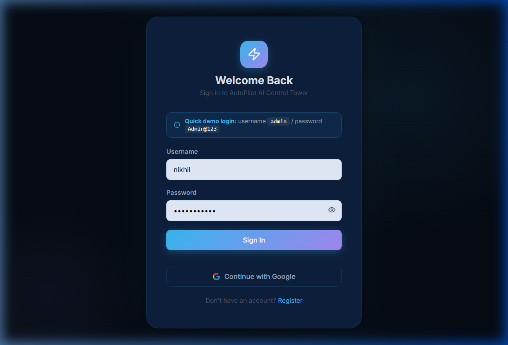
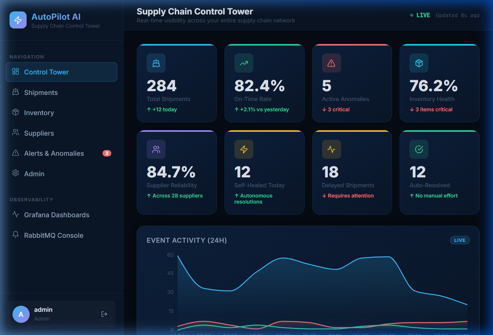
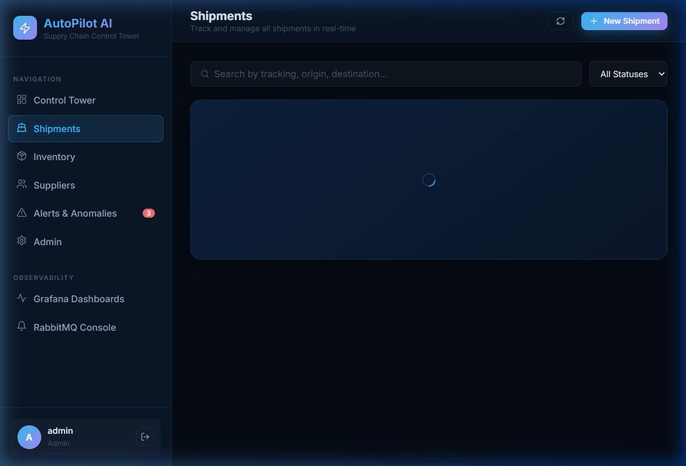

# 🚀 AutoPilot AI – Self-Healing Supply Chain Intelligence Platform
### Track 4: Real-Time Supply Chain Control Tower Agent | DeepFrog AI Solutions Pvt. Ltd.

---

## 📋 Problem Statement

Modern supply chains suffer from **reactive, siloed decision-making**. Disruptions—supplier delays, port congestion, inventory shortfalls, demand spikes—are often discovered too late, leading to cascading failures, revenue loss, and customer dissatisfaction.

**Root Problems:**
- No single pane of glass across the entire supply chain
- Manual anomaly detection – humans can't monitor hundreds of KPIs 24/7
- Slow incident response – days to reroute, reorder, or escalate
- No audit trail of what happened and why

---

## 💡 Solution

**AutoPilot AI** is an AI-powered, event-driven **Real-Time Supply Chain Control Tower** that:

1. **Monitors** shipments, inventory, suppliers, and demand in real-time
2. **Detects** anomalies automatically using AI agents (Worker 1)
3. **Heals itself** autonomously by executing smart recovery strategies (Worker 2)
4. **Provides full observability** through a unified dashboard + Grafana/Loki/Tempo stack

---

## 🏗️ Architecture

```
Frontend (React) ──── REST API ────► FastAPI Backend (MVC)
                                           │
                          ┌────────────────┼────────────────┐
                          ▼                ▼                ▼
                      PostgreSQL         Redis          RabbitMQ
                    (Encrypted PII)   (Idempotency)  (Event Broker)
                                                           │
                                   ┌──────────────────────┤
                                   ▼                      ▼
                           Worker 1 (Anomaly)    Worker 2 (Healing)
                           AI Detection          Auto-Resolution

                    ┌─────────────────────────────────────┐
                    │   Observability: Prometheus + Grafana │
                    │   + Loki (logs) + Tempo (traces)      │
                    └─────────────────────────────────────┘
```

---

## 🛠️ Tech Stack

| Layer | Technology |
|-------|------------|
| **Frontend** | React 18 + Vite, Recharts, React Router, Zustand |
| **Backend** | Python FastAPI (MVC pattern), SQLAlchemy (Singleton DB) |
| **Workers** | Python async workers (aio-pika), RabbitMQ consumers |
| **Queue** | RabbitMQ (topic exchange, durable, dead-letter) |
| **Cache/Idempotency** | Redis (OTP TTL, token store, dedup keys) |
| **Database** | PostgreSQL 16 (PII encrypted with Fernet) |
| **Auth** | JWT (access 15min + refresh 7d), Email OTP MFA, Google OAuth, RBAC |
| **Observability** | Prometheus + Grafana + Loki + Tempo + Promtail |
| **Containerization** | Docker Compose (12 services, single `supply-chain-net` network) |

---

## 📁 Project Structure

```
autopilot-supply-chain/
├── docker-compose.yml           ← All 12 services, single network
├── Dockerfile                   ← Multi-stage: backend / worker1 / worker2 / frontend
├── .env                         ← Ready-to-run defaults (no real secrets needed)
├── .env.example                 ← Environment variables template
│
├── backend/                     ← FastAPI (MVC pattern)
│   ├── app/
│   │   ├── main.py              ← App entry point + middleware
│   │   ├── core/                ← Config, Singleton DB, Security, Logging, Tracing
│   │   ├── models/              ← SQLAlchemy models (M in MVC)
│   │   ├── schemas/             ← Pydantic schemas (PII-safe)
│   │   ├── services/            ← Business logic + event publisher + MFA
│   │   ├── controllers/         ← Route handlers (C in MVC)
│   │   └── middlewares/         ← JWT/RBAC + request logging
│   └── scripts/
│       └── seed_demo_data.py    ← Populate DB with demo data
│
├── workers/
│   ├── shared/                  ← Queue client (atomic) + idempotency guard
│   ├── worker1_anomaly/         ← AI Anomaly Detection Agent
│   └── worker2_healing/         ← Self-Healing Orchestrator Agent
│
├── frontend/                    ← React + Vite dashboard
│   └── src/
│       ├── pages/               ← Dashboard, Shipments, Inventory, Suppliers, Alerts, Admin
│       ├── components/          ← Layout, Sidebar
│       ├── services/            ← Axios API client (auto token refresh) + demo mode
│       └── store/               ← Zustand auth store
│
└── observability/
    ├── prometheus/              ← Metrics scraping config
    ├── grafana/                 ← Pre-provisioned dashboards + datasources
    ├── loki/                    ← Log aggregation config
    ├── promtail/                ← Log shipper config
    └── tempo/                   ← Distributed tracing config
```

---

## 🚀 How to Run

### Prerequisites
- Docker Desktop (with WSL2 on Windows) — [Download here](https://www.docker.com/products/docker-desktop/)
- Docker Compose v2

### Steps

```bash
# 1. Clone and navigate to project
cd autopilot-supply-chain

# 2. Environment file is already configured (no secrets needed for demo)
# .env is ready-to-run with safe defaults

# 3. Start all services
docker compose up --build -d

# 4. Verify all services are healthy
docker compose ps

# 5. Seed demo data (after all services are healthy)
docker compose exec backend python scripts/seed_demo_data.py
```

### Quick Frontend Demo (no Docker required)

```bash
cd frontend
npm install
npm run dev
# Open http://localhost:3000
# Login: admin / Admin@123 / OTP: 123456 (auto-filled in demo mode)
```

### Service URLs

| Service | URL | Credentials |
|---------|-----|-------------|
| **Frontend Dashboard** | http://localhost:3000 | admin / Admin@123 |
| **Backend API Docs** | http://localhost:8000/api/docs | — |
| **Grafana** | http://localhost:3001 | admin / admin |
| **RabbitMQ Management** | http://localhost:15672 | admin / admin_pass |
| **Prometheus** | http://localhost:9090 | — |

### Demo Login Flow

1. Go to http://localhost:3000
2. Username: `admin`, Password: `Admin@123`
3. On MFA screen: click **"Auto-fill ⚡"** (OTP: 123456 in demo mode)
4. Dashboard loads with live KPIs and AI agent status

---

## ✅ Requirements Coverage

### Maintainability ✅
- [x] Clean MVC project structure (models → services → controllers)
- [x] README.md (Problem, Solution, Tech Stack, How to Run, Screenshots)
- [x] Model-View-Controller pattern (FastAPI: Models → Services → Controllers)
- [x] Singleton pattern for DB connection (`DatabaseManager` with metaclass)
- [x] REST API with versioned routes (`/api/v1/...`)
- [x] Structured error logging with structlog (JSON → Loki)

### Scalability ✅
- [x] Event-Driven Architecture (RabbitMQ TOPIC exchange, durable, dead-letter)
- [x] Workers are separate Docker services (NOT async jobs in backend)
- [x] RabbitMQ queue with durable messages + dead-letter exchange (DLX)
- [x] All services dockerized in single `docker-compose.yml`
- [x] Single `supply-chain-net` Docker network (DNS-based discovery)
- [x] 2 workers in parallel: Worker 1 (anomaly) + Worker 2 (healing)
- [x] Atomic task pickup (`prefetch_count=1` + `basic_ack`)
- [x] Idempotency via Redis deduplication keys (`IdempotencyGuard`)

### Platform Security ✅
- [x] Email/password login with bcrypt hashing
- [x] MFA: 6-digit OTP via email (5-min TTL in Redis, demo mode fallback)
- [x] JWT access tokens (60min) + refresh tokens (7d, stored in Redis)
- [x] Google OAuth2 login (additional points)
- [x] RBAC: Admin | Operator | Viewer roles enforced on every route
- [x] PII (email, phone) **NOT exposed** in any API response (Pydantic schemas)
- [x] PII encrypted in DB using **Fernet** (AES-128) symmetric encryption

### Observability ✅
- [x] Prometheus metrics (FastAPI instrumentator, `/metrics` endpoint)
- [x] Grafana dashboards (pre-provisioned: Prometheus + Loki + Tempo datasources)
- [x] Pre-built Supply Chain Control Tower dashboard (auto-loaded)
- [x] Loki log aggregation (JSON structured logs via Promtail)
- [x] Tempo distributed tracing (OpenTelemetry → OTLP → Tempo)
- [x] Request tracing across backend + workers (OTLP configured on all services)

---

## 🤖 AI Agent Details

### Worker 1: Anomaly Detection Agent
- **Subscribes to:** `shipment.*`, `inventory.low`, `supplier.*`
- **Detection logic:** Rule-based + statistical analysis
- **Detects:** Shipment delays (>4h), inventory shortfalls, supplier risk, customs holds
- **Publishes:** `anomaly.detected` events with AI confidence scores (0–1)
- **Idempotency:** Redis-backed dedup with 24h TTL

### Worker 2: Self-Healing Orchestrator
- **Subscribes to:** `anomaly.detected`
- **Healing strategies:**
  - **Shipment delay** → Priority rerouting + stakeholder notification + backup supplier
  - **Inventory low** → Auto purchase order + cross-warehouse reallocation
  - **Supplier risk** → Secondary supplier evaluation + risk review scheduling
  - **Route disruption** → Alternative route calculation + carrier notification
- **Persistence:** Writes healing result to PostgreSQL `alerts` table
- **Publishes:** `healing.completed` events with full audit trail

---

## 🔐 Security Design

- **PII fields** (email, phone) stored with Fernet (AES-128) encryption in DB
- **Pydantic schemas** intentionally omit PII fields from ALL API responses
- **Masked email** shown in admin view only (e.g., `jo***@company.com`)
- **RBAC** enforced via FastAPI dependencies on every protected route
- **JWT** with short-lived access tokens and revocable refresh tokens in Redis
- **OTP** expires in 5 minutes; stored only in Redis, never logged as plaintext

---

## 📊 Screenshots

### Login Page


> Full glassmorphism dark-mode UI with demo login hint and Google OAuth

### Supply Chain Control Tower Dashboard


> 8 real-time KPI cards, event activity chart (24h), shipment status donut chart, live anomaly feed, self-healing log, and worker status panels

### Shipments Management


> Track all shipments with status badges, delay indicators, and event publishing to trigger anomaly detection

---

## 👤 Author

Built for **DeepFrog AI Solutions Pvt. Ltd.** – Track 4: Real-Time Supply Chain Control Tower Agent
AutoPilot AI Team | April 2026
